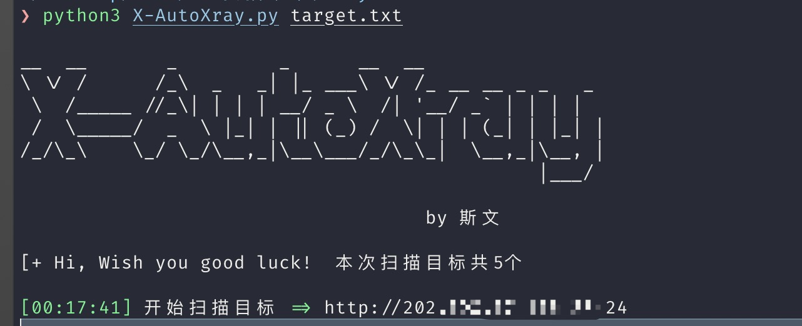

* Usage: 在高级版Xray和rad同目录下运行 python3 X-AutoXray.py xxxx.txt
* 1. 写的蛮人性化的哦，os,linux,windows通用
* 2. 生成的xray报告会在当前目录的/result下面
* 3. Ctrl+c  打断脚本运行时还可以结算扫描进度，生成已扫描和未扫描的进度文件，让你第二天上班时继续当一名xray工程师

* 建议: 存储目标的txt文件，域名最好为**http://192.168.1.1** ,自带http协议前缀，若不写好协议，xray只能自动分辨，准确率是无法保证的

#### 2022·7·12 更新历史
* 增加线程超时停止，防止某个目标爬取时间过长
#### 2020·12·26 更新历史
  * 增加文件名检测，防止重复扫描时忘记删除之前的扫描报告
  * 修复windows的颜色模块不正常显示
  * 修复windows的兼容问题
